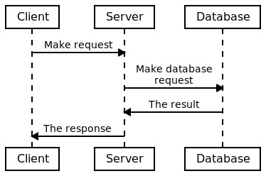
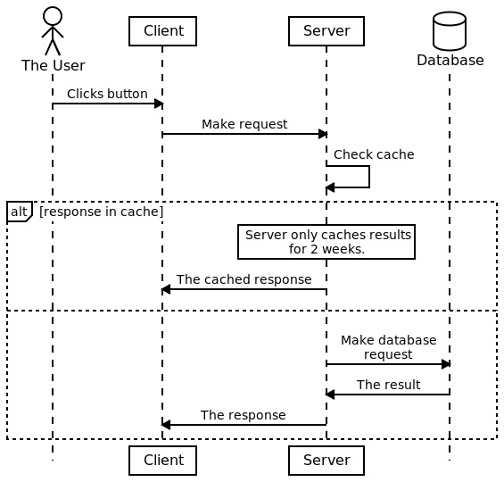

# goseq - text based sequence diagrams

A small command line utility used to generate UML sequence diagrams from a text-base definition file.

Inspired by [js-sequence-diagram](http://bramp.github.io/js-sequence-diagrams/) and
[websequencediagram](http://www.websequencediagrams.com/).

## Install

To install it:

    go install github.com/lmika/goseq@latest

## Usage

    goseq [FLAGS] FILES ...

Supported flags:

* `-o filename`: Specify output filename

## Sequence Diagrams

`goseq` generates sequence diagrams from a text files which defines the participants and
sequence of actions you want to represent:
            
    Client->Server: Make request
    Server->Database: Make database\nrequest
    Database->Server: The result
    Server->Client: The response

Sequence diagrams can also include things like blocks, notes and participant icons:

    participant User (icon="human"): The User
    participant Client
    participant Server
    participant Database (icon="cylinder")

    User->Client: Clicks button
    Client->Server: Make request
    Server->Server: Check cache
    alt: [response in cache]
        note over Server: Server only caches results\nfor 2 weeks.
        Server->Client: The cached response
    else:
        Server->Database: Make database\nrequest
        Database->Server: The result
        Server->Client: The response
    end

For details and examples, please see
[the Language Guide](https://goseq.lmika.dev/docs/language-guide) and [Style Attribute reference](https://goseq.lmika.dev/docs/style-attributes).

## Licence

Released under the MIT Licence.
